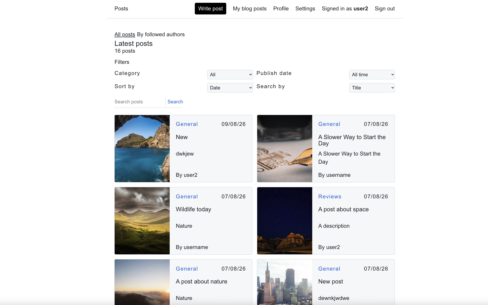
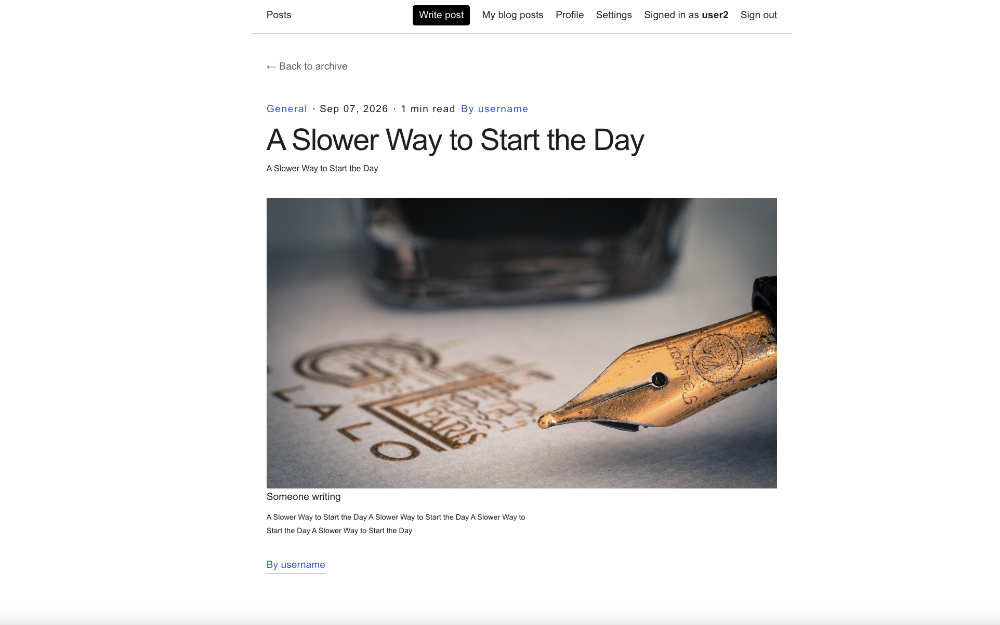

# The Blog

The Blog is an app where you can upload blog posts and view other people's posts.  
You can also follow posters.


*The home page*

*A post*

## Pre-requisites
`.env` file with `API_URL`, `AUTH_SECRET` and
`UPLOADTHING_TOKEN`, `AUTH_TRUST_HOST` variables set. The values from `.env.example` can be used but `UPLOADTHING_TOKEN` needs to be a real token.
An Uploadthing account with token is needed for image uploads to work. It can be created on this website:  
https://uploadthing.com/

## Run development server

Install dependencies with:

```
npm install
```

Run the development server:

```bash
npm run dev:full
# or
yarn dev
# or
pnpm dev
# or
bun dev
```

Open [http://localhost:3000](http://localhost:3000) with your browser to see the result.

## How to build for production

```bash
npm run build
```

## How to run production build

```bash
# this will run the next.js frontend and json-server mock server
npm run start
```

## Tech stack used
Github copilot prompts used to create prototype and initial code base.  
Next.js with App router for frontend and server side actions.  
NextAuth.js/Auth.js for authentication.  
Uploadthing for image uploads and storage.  
Json-server for mock CRUD server and database (db.json).

## Not yet implemented
Email confirmation.  
Reset password functionality.   
User blacklist.  
Non-mock backend with a real database. 
